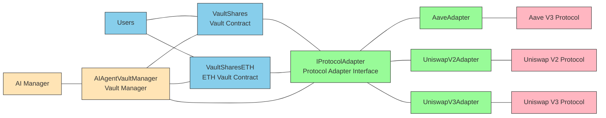

# AI Vault Development Documentation

## 🏗 System Architecture

### Core Components

#### 1. AIAgentVaultManager.sol

AI Agent Vault Manager, responsible for:

- Managing vault asset allocation strategies
- Approving and managing protocol adapters
- Providing interfaces for AI agent operations
- Controlling emergency stop functionality for vaults
- Configuring specific parameters for protocol adapters
- Supporting batch operations and direct adapter function calls

#### 2. VaultShares.sol & VaultSharesETH.sol

Core vault contracts with features including:

- Implementation based on ERC-4626 standard
- Support for deposits, withdrawals, and share management
- Managing fund allocation across different DeFi protocols
- Charging management fees (currently 1%)
- Supporting partial or complete investment strategy updates
- Implementing reentrancy protection and ownership control
- **VaultSharesETH**: Specifically handles ETH/WETH conversion

#### 3. Protocol Adapters

Providing unified interfaces for different DeFi protocols:

**AaveAdapter.sol**

- Supports depositing and borrowing assets on Aave V3
- Obtains deposit interest income
- Implements precise asset value calculations

**UniswapV2Adapter.sol**

- Supports providing liquidity on Uniswap V2
- Automatically calculates optimal trading paths
- Manages slippage tolerance settings
- Configures token pairs and paired tokens

**UniswapV3Adapter.sol**

- Supports providing liquidity on Uniswap V3
- Supports specifying price ranges (tickLower and tickUpper)
- Implements more granular liquidity management
- Supports NFT liquidity position management

### System Architecture Diagram



## 🔄 AI Vault Workflow

1. **Vault Creation**: AI manager configures protocol and adds vault contracts through AIAgentVaultManager
2. **Adapter Configuration**: AI manager configures protocol adapter parameters through AIAgentVaultManager
3. **Strategy Development**: AI manager develops investment strategies through AIAgentVaultManager
4. **Strategy Execution**: AIAgentVaultManager calls VaultShares to execute investment strategies
5. **Fund Allocation**: VaultShares allocates funds to different DeFi protocols through protocol adapters
6. **Yield Generation**: Each protocol generates returns and returns them to VaultShares
7. **Yield Distribution**: VaultShares distributes returns to share holders

## 🧪 Test Coverage

The project includes a complete test suite:

### Unit Tests

- `AaveAdapter.t.sol` - Aave adapter tests
- `UniswapV2Adapter.t.sol` - Uniswap V2 adapter tests
- `UniswapV3Adapter.t.sol` - Uniswap V3 adapter tests
- `VaultShares.t.sol` - Vault contract tests
- `VaultSharesETH.t.sol` - ETH vault contract tests
- `AIAgentVaultManager.t.sol` - AI agent manager tests

### Integration Tests

- `RealProtocolIntegration.t.sol` - Real protocol integration tests
- `RealNetworkForkTest.sol` - Real network fork tests

### Mock Contracts

- `MockToken.sol` - Mock token contract
- `MockAavePool.sol` - Mock Aave pool contract
- `MockUniswapV2.sol` - Mock Uniswap V2 contract
- `RealisticUniswapV3.sol` - Realistic Uniswap V3 mock

### Running Tests

Run smart contract tests:

```bash
yarn test
```

## 📜 Deployment and Script Execution

The project includes multiple deployment and test scripts located in the `packages/foundry/script/` directory.

### Available Scripts

#### 1. Deploy.s.sol - Complete Deployment Script

Deploy all core contracts (including VaultShares, adapters, etc.):

```bash
yarn deploy
```

#### 2. SimulateTrading.s.sol - Trading Simulation Script

Simulates the complete trading flow of the vault, including real trading behaviors of 4 different types of users:

**Feature Description:**

This script simulates 4 different types of users:

- **Admin (Administrator)**: System administrator with mixed investment strategy
- **User1 (Conservative Investor)**: Large stablecoin investment, long-term holding (7 days), minimal redemption
- **User2 (ETH Investor)**: Focused on ETH investment, medium risk, partial redemption and additional deposits
- **User3 (Active Trader)**: Diversified investment, frequent trading, portfolio rebalancing

**Execution Method:**

Run on local chain:

```bash
# 1. Start local chain
yarn chain

# 2. Deploy contracts in new terminal
yarn deploy

# 3. Execute simulation trading script in third terminal, enter foundry folder
forge script script/SimulateTrading.s.sol --broadcast --rpc-url http://localhost:8545
```

Run on testnet:

```bash
forge script script/SimulateTrading.s.sol --broadcast --rpc-url http://localhost:8545
```

**Script Execution Flow:**

1. Connect to deployed contracts (VaultManager, vaults, adapters, etc.)
2. Allocate tokens and ETH to 4 test accounts
3. Execute trading operations for each user:
   - Admin: Deposit 20,000 USDC, 15,000 USDT, 50 ETH, redeem 1/20 after 1 day
   - User1: Deposit 50,000 USDC, 30,000 USDT, redeem only 1/50 after 7 days
   - User2: Deposit 25 ETH, redeem 1/5 after 3 days, then deposit 5 ETH
   - User3: Deposit 15,000 USDC, 10,000 USDT, frequent trading and rebalancing
4. Output final balances and shares for all accounts

⚠️ **Note**:

- The script uses fixed test account private keys, only for development testing
- If contracts are redeployed, contract addresses need to be updated in the script (`_getDeployedAddresses()` method)
- After execution, transaction data can be viewed through The Graph or console output

#### 4. VerifyAll.s.sol - Contract Verification Script

Verify deployed contracts on block explorer:

```bash
yarn verify
```

### Deploy to Different Networks

**Local Network (Anvil):**

```bash
# Start local chain
yarn chain

# Deploy in new terminal
yarn deploy
```

**Testnet (e.g., Sepolia):**

```bash
forge script script/Deploy.s.sol --rpc-url sepolia --broadcast --verify
```

**Mainnet:**

```bash
forge script script/Deploy.s.sol --rpc-url mainnet --broadcast --verify
```

## 🚀 Setting Up The Graph Integration

Now that we have started the blockchain, started the frontend application and deployed the smart contracts, we can begin setting up our subgraph and leveraging The Graph!

> Before following these steps, make sure Docker is running!

### ✅ Step 1: Clean Old Data and Start Docker Containers

First run the following command to clean any old data. If you need to reset everything, please do so.

```bash
yarn subgraph:clean-node
```

> Now we can start a graph node by running the following command... 🧑‍🚀

```bash
yarn subgraph:run-node
```

This will start all containers for The Graph using docker-compose. You need to keep this window open at all times so you can see the Docker log output.

> As mentioned before, please make sure to keep this window open at all times so you can see any log output from Docker. 🔎

> Note: If you run Linux, you need to make some additional changes to the project.

#### Linux Only

**For hardhat**

Update your hardhat chain in package.json in packages/hardhat with the following command line options.

```json
"chain": "hardhat node --network hardhat --no-deploy --hostname 0.0.0.0"
```

**For foundry**

Update your anvil chain in package.json in packages/foundry with the following command line options.

```json
"chain": "anvil --host 0.0.0.0 --config-out localhost.json"
```

Save the file, then restart your chain in its original window.

```bash
yarn chain
```

Redeploy your smart contracts.

```bash
yarn deploy
```

You may also need to add a firewall exception for port 8432. For Ubuntu... run the following command.

```bash
sudo ufw allow 8545/tcp
```

### ✅ Step 2: Create and Deploy Our Subgraph

Now we can open a fifth window to complete The Graph setup. 😅 In this fifth window, we will create our local subgraph!

> Note: You only need to do this once.

```bash
yarn subgraph:create-local
```

> You should see some output stating that your subgraph has been created, along with log output from the graph-node inside docker.

Next we will deploy our subgraph! After executing this command, you need to give the subgraph a version. (e.g. 0.0.1).

```bash
yarn subgraph:local-ship
```

> This command does all of the following in one go... 🚀🚀🚀

- Copy contract ABI from hardhat/deployments folder
- Generate networks.json file
- Generate AssemblyScript types from subgraph schema and contract ABI
- Compile and check mapping functions
- ...and deploy the local subgraph!

> If you encounter ts-node errors, you can install it using the following command

```bash
npm install -g ts-node
```

You should get build completion output along with the subgraph endpoint address.

```
Build completed: QmYdGWsVSUYTd1dJnqn84kJkDggc2GD9RZWK5xLVEMB9iP

Deployed to http://localhost:8000/subgraphs/name/scaffold-eth/your-contract/graphql

Subgraph endpoints:
Queries (HTTP):     http://localhost:8000/subgraphs/name/scaffold-eth/your-contract
```

### ✅ Step 3: Test Your Subgraph

Continue to your subgraph endpoint to check it out!

> Here's an example query...

```graphql
{
  greetings(first: 25, orderBy: createdAt, orderDirection: desc) {
    id
    greeting
    premium
    value
    createdAt
    sender {
      address
      greetingCount
    }
  }
}
```

> If everything is working correctly and you have sent transactions to the smart contract, then you will see similar data output!

### ✅ Step 4: Create Graph Client Artifacts

Graph Client is a tool for querying GraphQL-based applications, containing many advanced features such as client composition or automatic pagination. The complete feature list and goals for this project can be found [here](https://github.com/graphprotocol/graph-client?tab=readme-ov-file#features-and-goals).

To use Graph-Client in our application, we need to build the artifacts required by the frontend. To do this, just run...

```bash
yarn graphclient:build
```

After completion, navigate to http://localhost:3000/subgraph, and you should be able to see GraphQL rendered in your application. If you can't see anything, make sure you have triggered events in the smart contract.

If you want to see this query code, you can find the component in the subgraph folder `packages/nextjs/app/subgraph/_components/GreetingsTable.tsx`.

### ✅ Side Quest: Run Matchstick Tests

Matchstick is a [unit testing framework](https://thegraph.com/docs/en/developing/unit-testing-framework/) developed by [LimeChain](https://limechain.tech/) that enables subgraph developers to test their mapping logic in a sandbox environment and confidently deploy their subgraphs!

The project includes a pre-written test in `packages/subgraph/tests/asserts.test.ts`

To test, just enter...

```bash
yarn subgraph:test
```

> This will run `graph test` and automatically download the files needed for testing.

You should receive the following output.

```
Fetching latest version tag...
Downloading release from https://github.com/LimeChain/matchstick/releases/download/0.6.0/binary-macos-11-m1
binary-macos-11-m1 has been installed!

Compiling...

💬 Compiling asserts...

Igniting tests 🔥

asserts
--------------------------------------------------
  Asserts:
    √ Greeting and Sender entities - 0.102ms

All 1 tests passed! 😎

[Thu, 07 Mar 2024 15:10:26 -0800] Program executed in: 1.838s.
```

> Note: If you encounter errors, you can try passing the `-d` flag `yarn subgraph:test -d`. This will run matchstick in the docker container.

## 🚀 Deploy to Subgraph Studio

> Note: This step requires deploying contracts to a live network. Check the supported [network list](https://thegraph.com/docs/networks).

1. Update the `packages/subgraph/subgraph.yaml` file with your contract address, network name, start block number (optional):

   ```diff
   ...
   -     network: localhost
   +     network: sepolia
         source:
           abi: YourContract
   +       address: "0x54FE7f8Db97e102D3b7d86cc34D885B735E31E8e"
   +       startBlock: 5889410
   ...
   ```

   Tip: For `startBlock`, you can use the block number of the deployed contract, which can be found by visiting the deployed transaction hash in the block explorer.

2. Create a new subgraph on [Subgraph Studio](https://thegraph.com/studio) and get the "SUBGRAPH SLUG" and "DEPLOY KEY".

3. Authenticate using graph CLI:

   ```sh
   yarn graph auth --studio <DEPLOY KEY>
   ```

4. Deploy the subgraph to TheGraph Studio:

   ```sh
   yarn graph deploy --studio <SUBGRAPH SLUG>
   ```

   After deployment, the CLI should output the subgraph endpoint. Copy the HTTP endpoint and test your queries.

5. Update `packages/nextjs/components/ScaffoldEthAppWithProviders.tsx` to use the above HTTP subgraph endpoint:
   ```diff
   - const subgraphUri = "http://localhost:8000/subgraphs/name/scaffold-eth/your-contract";
   + const subgraphUri = 'YOUR_SUBGRAPH_ENDPOINT';
   ```

## 📋 Complete List of Available Root Commands

# Format code

yarn format

# Code linting

yarn lint

### graph

```sh
yarn graph
```

Shortcut to run `@graphprotocol/graph-cli`, scoped to the subgraph package.

### run-node

```sh
yarn subgraph:run-node
```

Start local graph node (requires Docker).

### stop-node

```sh
yarn subgraph:stop-node
```

Stop local graph node.

### clean-node

```sh
yarn clean-node
```

Remove data from local graph node.

### local-create

```sh
yarn subgraph:create-local
```

Create your local subgraph (only needed once).

### local-remove

```sh
yarn subgraph:remove-local
```

Remove local subgraph.

### abi-copy

```sh
yarn subgraph:abi-copy
```

Copy contract ABI from hardhat/deployments folder. Also generates networks.json file.

### codegen

```sh
yarn subgraph:codegen
```

Generate AssemblyScript types from subgraph schema and contract ABI.

### build

```sh
yarn subgraph:build
```

Compile and check mapping functions.

### local-ship

```sh
yarn subgraph:local-ship
```

Run all commands needed to deploy local subgraph (abi-copy, codegen, build and local-deploy).

## 🔧 Development and Customization

### Edit Smart Contracts

Edit your smart contracts in `packages/foundry/contracts`

### Edit Frontend Homepage

Edit your frontend homepage in `packages/nextjs/app/page.tsx`. For guidance on [routing](https://nextjs.org/docs/app/building-your-application/routing/defining-routes) and configuring [pages/layouts](https://nextjs.org/docs/app/building-your-application/routing/pages-and-layouts), check the Next.js documentation.

### Edit Deployment Scripts

Edit your deployment scripts in `packages/foundry/script`

### Using SE-2 Hooks

```typescript
// Read contract data
const { data: someData } = useScaffoldReadContract({
  contractName: "AIAgentVaultManager",
  functionName: "getApprovedAdapters",
});

// Write contract data
const { writeContractAsync: writeManagerAsync } = useScaffoldWriteContract({
  contractName: "AIAgentVaultManager",
});

// Usage (this will send a write transaction to the contract)
await writeManagerAsync({
  functionName: "updateAllocation",
  args: [vaultAddress, adapters, allocations],
});
```

## 🛡️ Security Considerations

### Code Quality

The project uses Aderyn for static analysis to detect potential security issues:

- High priority issues: 2 (fixed)
- Low priority issues: 13 (optimized)
- Total lines of code: 2,507 lines of Solidity code

### Security Measures

1. **Access Control**: Only authorized AI agents can execute investment strategies
2. **Reentrancy Protection**: All critical functions have reentrancy protection
3. **Parameter Validation**: Strict input parameter validation and boundary checks
4. **Emergency Stop**: Support for stopping all operations in emergency situations
5. **Code Audit**: Code quality checks using static analysis tools

## 📁 Project Structure

```
packages/foundry/
├── contracts/
│   ├── interfaces/           # Interface definitions
│   │   ├── IProtocolAdapter.sol
│   │   ├── IVaultShares.sol
│   │   └── IWETH9.sol
│   ├── protocol/            # Core protocol contracts
│   │   ├── AIAgentVaultManager.sol
│   │   ├── VaultShares.sol
│   │   ├── VaultSharesETH.sol
│   │   └── investableUniverseAdapters/
│   │       ├── AaveAdapter.sol
│   │       ├── UniswapV2Adapter.sol
│   │       └── UniswapV3Adapter.sol
│   └── vendor/              # Third-party contract interfaces
│       ├── AaveV3/
│       ├── UniswapV2/
│       └── UniswapV3/
├── test/                    # Test files
│   ├── integration/         # Integration tests
│   ├── fork/               # Fork tests
│   └── mock/               # Mock contracts
├── script/                 # Deployment scripts
└── lib/                    # Dependency libraries
```

## 🤝 Contributing

We welcome contributions to the Scaffold-ETH 2 and AI Vault projects!

Please check [CONTRIBUTING.MD](https://github.com/scaffold-eth/scaffold-eth-2/blob/main/CONTRIBUTING.md) for more information and guidelines on contributing to Scaffold-ETH 2.

### Development Standards

- Use Solidity 0.8.25
- Follow OpenZeppelin standards
- Write complete test cases
- Add detailed code comments
- Pass all static analysis checks

### Contribution Steps

1. Fork the project repository
2. Create feature branch: `git checkout -b feature/new-feature`
3. Commit changes: `git commit -m 'Add new feature'`
4. Push branch: `git push origin feature/new-feature`
5. Create Pull Request

## 🚀 Future Development Directions

1. **More Protocol Support**: Add support for Curve, Compound, Yearn and other protocols
2. **Advanced Strategies**: Implement more complex AI investment strategies and algorithms
3. **Risk Management**: Integrate risk assessment and control mechanisms
4. **Governance Features**: Add DAO governance functionality for user participation in decision-making
5. **Performance Optimization**: Further optimize gas consumption and contract execution efficiency
6. **Multi-chain Support**: Extend to other EVM-compatible chains
7. **Mobile Support**: Develop mobile applications
8. **API Integration**: Provide REST API and GraphQL interfaces
