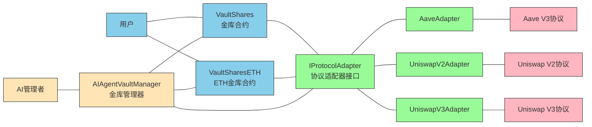

# 🏗 Scaffold-ETH 2 - AI Vault 项目

<h4 align="center">
  <a href="https://docs.scaffoldeth.io">文档</a> |
  <a href="https://scaffoldeth.io">网站</a>
</h4>

🧪 一个开源、最新的工具包，用于在以太坊区块链上构建去中心化应用程序（dapps）。它旨在让开发者更容易创建和部署智能合约，并构建与这些合约交互的用户界面。

⚙️ 使用 NextJS、RainbowKit、Foundry、Wagmi、Viem 和 Typescript 构建。

- ✅ **合约热重载**: 前端会在你编辑智能合约时自动适配。
- 🪝 **[自定义钩子](https://docs.scaffoldeth.io/hooks/)**: 围绕 [wagmi](https://wagmi.sh/) 的 React 钩子集合，用于简化与智能合约的交互，并提供 TypeScript 自动补全。
- 🧱 [**组件**](https://docs.scaffoldeth.io/components/): 常见 web3 组件集合，用于快速构建前端。
- 🔥 **燃烧钱包和本地水龙头**: 使用燃烧钱包和本地水龙头快速测试你的应用程序。
- 🔐 **钱包提供商集成**: 连接到不同的钱包提供商并与以太坊网络交互。


## 🚀 AI Vault 项目概述

AI Vault 是一个基于 Scaffold-ETH 2 构建的去中心化金融（DeFi）项目，旨在为用户提供智能资产管理服务。该项目通过 AI 代理管理投资策略，将资金分配到不同的 DeFi 协议中以获取收益。

### 核心特性

- 💰 **智能金库管理**: 基于 ERC-4626 标准的份额化投资金库
- 🤖 **AI 代理控制**: 由 AI 代理自动管理投资策略和资产分配
- 🔄 **多协议支持**: 集成 Aave、Uniswap V2/V3 等主流 DeFi 协议
- 💎 **ETH 支持**: 支持 ETH 和 WETH 的直接存款和转换
- 🛡️ **安全保障**: 防重入攻击、权限控制和参数验证
- 📊 **实时监控**: 完整的测试套件和集成测试

## 系统要求

在开始之前，你需要安装以下工具：

- [Node (>= v20.18.3)](https://nodejs.org/en/download/)
- Yarn ([v1](https://classic.yarnpkg.com/en/docs/install/) 或 [v2+](https://yarnpkg.com/getting-started/install))
- [Git](https://git-scm.com/downloads)
- [Foundry](https://book.getfoundry.sh/getting-started/installation)

## 快速开始

要开始使用 Scaffold-ETH 2 和 AI Vault 项目，请按照以下步骤操作：

### 1. 安装依赖

```bash
git clone https://github.com/KamisAyaka/ai_vault.git
cd ai_vault
yarn install
```

### 2. 启动本地网络

在第一个终端中运行：

```bash
yarn chain
```

此命令使用 Foundry 启动本地以太坊网络。网络在你的本地机器上运行，可用于测试和开发。你可以在 `packages/foundry/foundry.toml` 中自定义网络配置。

### 3. 部署 AI Vault 合约

在第二个终端中，部署 AI Vault 系统：

```bash
# 部署完整的 AI Vault 系统
yarn deploy --file DeployAIVault.s.sol

# 或者部署基础测试合约
yarn deploy
```

此命令将 AI Vault 智能合约部署到本地网络。合约位于 `packages/foundry/contracts` 中，可以根据需要进行修改。`yarn deploy` 命令使用位于 `packages/foundry/script` 的部署脚本来将合约部署到网络。

### 4. 启动前端应用

在第三个终端中，启动你的 NextJS 应用：

```bash
yarn start
```

访问你的应用：`http://localhost:3000`。你可以使用 `Debug Contracts` 页面与你的智能合约交互。你可以在 `packages/nextjs/scaffold.config.ts` 中调整应用配置。

### 5. 运行测试

运行智能合约测试：

```bash
yarn test
```

## 🏗 AI Vault 系统架构

### 核心组件

#### 1. AIAgentVaultManager.sol

AI 代理金库管理器，负责：

- 管理金库资产分配策略
- 批准和管理协议适配器
- 提供 AI 代理执行操作的接口
- 控制金库的紧急停止等功能
- 配置协议适配器的具体参数
- 支持批量操作和直接调用适配器函数

#### 2. VaultShares.sol & VaultSharesETH.sol

核心金库合约，功能包括：

- 基于 ERC-4626 标准实现
- 支持存款、取款和份额管理
- 管理资金在不同 DeFi 协议间的分配
- 收取管理费用（目前为 1%）
- 支持部分或全部更新投资策略
- 实现防重入保护和所有权控制
- **VaultSharesETH**: 专门处理 ETH/WETH 转换

#### 3. 协议适配器

为不同 DeFi 协议提供统一接口：

**AaveAdapter.sol**

- 支持在 Aave V3 上存借资产
- 获取存款利息收益
- 实现精确的资产价值计算

**UniswapV2Adapter.sol**

- 支持在 Uniswap V2 上提供流动性
- 自动计算最优交易路径
- 管理滑点容忍度设置
- 配置代币对和配对代币

**UniswapV3Adapter.sol**

- 支持在 Uniswap V3 上提供流动性
- 支持指定价格区间（tickLower 和 tickUpper）
- 实现更精细的流动性管理
- 支持 NFT 流动性头寸管理

### 系统架构图



## 🔄 AI Vault 工作流程

1. **金库创建**: AI 管理者通过 AIAgentVaultManager 配置协议添加金库合约
2. **适配器配置**: AI 管理者通过 AIAgentVaultManager 配置协议适配器参数
3. **策略制定**: AI 管理者通过 AIAgentVaultManager 制定投资策略
4. **策略执行**: AIAgentVaultManager 调用 VaultShares 执行投资策略
5. **资金分配**: VaultShares 通过协议适配器将资金分配到不同 DeFi 协议
6. **收益获取**: 各协议产生收益并返回给 VaultShares
7. **收益分配**: VaultShares 将收益分配给份额持有者

## 🧪 测试覆盖

项目包含完整的测试套件：

### 单元测试

- `AaveAdapter.t.sol` - Aave 适配器测试
- `UniswapV2Adapter.t.sol` - Uniswap V2 适配器测试
- `UniswapV3Adapter.t.sol` - Uniswap V3 适配器测试
- `VaultShares.t.sol` - 金库合约测试
- `VaultSharesETH.t.sol` - ETH 金库合约测试
- `AIAgentVaultManager.t.sol` - AI 代理管理器测试

### 集成测试

- `RealProtocolIntegration.t.sol` - 真实协议集成测试
- `RealNetworkForkTest.sol` - 真实网络分叉测试

### Mock 合约

- `MockToken.sol` - 模拟代币合约
- `MockAavePool.sol` - 模拟 Aave 池合约
- `MockUniswapV2.sol` - 模拟 Uniswap V2 合约
- `RealisticUniswapV3.sol` - 真实的 Uniswap V3 模拟

## 🚀 设置 The Graph 集成

现在我们已经启动了区块链，开始了前端应用程序并部署了智能合约，我们可以开始设置我们的子图并利用 The Graph！

> 在遵循这些步骤之前，请确保 Docker 正在运行！

### ✅ 步骤 1: 清理旧数据并启动 Docker 容器

首先运行以下命令清理任何旧数据。如果你需要重置所有内容，请这样做。

```bash
yarn subgraph:clean-node
```

> 现在我们可以通过运行以下命令启动一个图节点... 🧑‍🚀

```bash
yarn subgraph:run-node
```

这将使用 docker-compose 为 The Graph 启动所有容器。你需要始终保持此窗口打开，以便可以看到 Docker 的日志输出。

> 如前所述，请确保始终保持此窗口打开，以便可以看到 Docker 的任何日志输出。🔎

> 注意：如果你运行 Linux，你需要对项目进行一些额外的更改。

#### 仅限 Linux

**对于 hardhat**

在 packages/hardhat 中使用以下命令行选项更新你的 package.json 中的 hardhat 链。

```json
"chain": "hardhat node --network hardhat --no-deploy --hostname 0.0.0.0"
```

**对于 foundry**

在 packages/foundry 中使用以下命令行选项更新你的 package.json 中的 anvil 链。

```json
"chain": "anvil --host 0.0.0.0 --config-out localhost.json"
```

保存文件，然后在其原始窗口中重启你的链。

```bash
yarn chain
```

重新部署你的智能合约。

```bash
yarn deploy
```

你可能还需要为端口 8432 添加防火墙例外。以 Ubuntu 为例...运行以下命令。

```bash
sudo ufw allow 8545/tcp
```

### ✅ 步骤 2: 创建并部署我们的子图

现在我们可以打开第五个窗口来完成 The Graph 的设置。😅 在这个第五个窗口中，我们将创建我们的本地子图！

> 注意：你只需要做一次。

```bash
yarn subgraph:create-local
```

> 你应该看到一些输出，说明你的子图已创建，以及 docker 内 graph-node 的日志输出。

接下来我们将部署我们的子图！执行此命令后，你需要给子图一个版本。（例如 0.0.1）。

```bash
yarn subgraph:local-ship
```

> 此命令一次性完成以下所有操作... 🚀🚀🚀

- 从 hardhat/deployments 文件夹复制合约 ABI
- 生成 networks.json 文件
- 从子图模式和合约 ABI 生成 AssemblyScript 类型
- 编译并检查映射函数
- ...并部署本地子图！

> 如果你遇到 ts-node 错误，可以使用以下命令安装它

```bash
npm install -g ts-node
```

你应该得到构建完成的输出以及子图端点的地址。

```
Build completed: QmYdGWsVSUYTd1dJnqn84kJkDggc2GD9RZWK5xLVEMB9iP

Deployed to http://localhost:8000/subgraphs/name/scaffold-eth/your-contract/graphql

Subgraph endpoints:
Queries (HTTP):     http://localhost:8000/subgraphs/name/scaffold-eth/your-contract
```

### ✅ 步骤 3: 测试你的子图

继续前往你的子图端点查看！

> 这是一个示例查询...

```graphql
{
  greetings(first: 25, orderBy: createdAt, orderDirection: desc) {
    id
    greeting
    premium
    value
    createdAt
    sender {
      address
      greetingCount
    }
  }
}
```

> 如果一切正常，并且你已经向智能合约发送了交易，那么你将看到类似的数据输出！

### ✅ 步骤 4: 创建 Graph Client 工件

Graph Client 是一个用于查询基于 GraphQL 的应用程序的工具，包含许多高级功能，例如客户端组合或自动分页。此项目的完整功能列表和目标可以在[这里](https://github.com/graphprotocol/graph-client?tab=readme-ov-file#features-and-goals)找到。

为了在我们的应用程序中使用 Graph-Client，我们需要构建前端所需的工件。为此，只需运行...

```bash
yarn graphclient:build
```

完成后，导航到 http://localhost:3000/subgraph，你应该能够看到 GraphQL 在你的应用程序中渲染。如果你看不到任何内容，请确保你已经在智能合约中触发了事件。

如果你想查看此查询代码，可以在子图文件夹 `packages/nextjs/app/subgraph/_components/GreetingsTable.tsx` 中找到组件。

### ✅ 支线任务：运行 Matchstick 测试

Matchstick 是一个[单元测试框架](https://thegraph.com/docs/en/developing/unit-testing-framework/)，由 [LimeChain](https://limechain.tech/) 开发，使子图开发者能够在沙盒环境中测试他们的映射逻辑，并自信地部署他们的子图！

项目在 `packages/subgraph/tests/asserts.test.ts` 中包含一个预写的测试

要测试，只需输入...

```bash
yarn subgraph:test
```

> 这将运行 `graph test` 并自动下载测试所需的文件。

你应该收到以下输出。

```
Fetching latest version tag...
Downloading release from https://github.com/LimeChain/matchstick/releases/download/0.6.0/binary-macos-11-m1
binary-macos-11-m1 has been installed!

Compiling...

💬 Compiling asserts...

Igniting tests 🔥

asserts
--------------------------------------------------
  Asserts:
    √ Greeting and Sender entities - 0.102ms

All 1 tests passed! 😎

[Thu, 07 Mar 2024 15:10:26 -0800] Program executed in: 1.838s.
```

> 注意：如果你遇到错误，可以尝试传递 `-d` 标志 `yarn subgraph:test -d`。这将在 docker 容器中运行 matchstick。

## 🚀 部署到 Subgraph Studio

> 注意：此步骤需要将合约部署到实时网络。查看支持的[网络列表](https://thegraph.com/docs/networks)。

1. 使用你的合约地址、网络名称、起始区块号（可选）更新 `packages/subgraph/subgraph.yaml` 文件：

   ```diff
   ...
   -     network: localhost
   +     network: sepolia
         source:
           abi: YourContract
   +       address: "0x54FE7f8Db97e102D3b7d86cc34D885B735E31E8e"
   +       startBlock: 5889410
   ...
   ```

   提示：对于 `startBlock`，你可以使用已部署合约的区块号，可以通过访问区块浏览器中的已部署交易哈希来找到。

2. 在 [Subgraph Studio](https://thegraph.com/studio) 上创建新的子图并获取 "SUBGRAPH SLUG" 和 "DEPLOY KEY"。

3. 使用 graph CLI 进行身份验证：

   ```sh
   yarn graph auth --studio <DEPLOY KEY>
   ```

4. 将子图部署到 TheGraph Studio：

   ```sh
   yarn graph deploy --studio <SUBGRAPH SLUG>
   ```

   部署完成后，CLI 应该输出子图端点。复制 HTTP 端点并测试你的查询。

5. 更新 `packages/nextjs/components/ScaffoldEthAppWithProviders.tsx` 以使用上述 HTTP 子图端点：
   ```diff
   - const subgraphUri = "http://localhost:8000/subgraphs/name/scaffold-eth/your-contract";
   + const subgraphUri = 'YOUR_SUBGRAPH_ENDPOINT';
   ```

## 📋 所有可用的根命令列表

### graph

```sh
yarn graph
```

运行 `@graphprotocol/graph-cli` 的快捷方式，范围限定为子图包。

### run-node

```sh
yarn subgraph:run-node
```

启动本地图节点（需要 Docker）。

### stop-node

```sh
yarn subgraph:stop-node
```

停止本地图节点。

### clean-node

```sh
yarn clean-node
```

从本地图节点删除数据。

### local-create

```sh
yarn subgraph:create-local
```

创建你的本地子图（只需要一次）。

### local-remove

```sh
yarn subgraph:remove-local
```

删除本地子图。

### abi-copy

```sh
yarn subgraph:abi-copy
```

从 hardhat/deployments 文件夹复制合约 ABI。也会生成 networks.json 文件。

### codegen

```sh
yarn subgraph:codegen
```

从子图模式和合约 ABI 生成 AssemblyScript 类型。

### build

```sh
yarn subgraph:build
```

编译并检查映射函数。

### local-ship

```sh
yarn subgraph:local-ship
```

运行部署本地子图所需的所有命令（abi-copy、codegen、build 和 local-deploy）。

## 🔧 开发和定制

### 编辑智能合约

在 `packages/foundry/contracts` 中编辑你的智能合约

### 编辑前端首页

在 `packages/nextjs/app/page.tsx` 中编辑你的前端首页。有关[路由](https://nextjs.org/docs/app/building-your-application/routing/defining-routes)和配置[页面/布局](https://nextjs.org/docs/app/building-your-application/routing/pages-and-layouts)的指导，请查看 Next.js 文档。

### 编辑部署脚本

在 `packages/foundry/script` 中编辑你的部署脚本

### 使用 SE-2 钩子

```typescript
// 读取合约数据
const { data: someData } = useScaffoldReadContract({
  contractName: "AIAgentVaultManager",
  functionName: "getApprovedAdapters",
});

// 写入合约数据
const { writeContractAsync: writeManagerAsync } = useScaffoldWriteContract({
  contractName: "AIAgentVaultManager",
});

// 使用方式（这将向合约发送写入交易）
await writeManagerAsync({
  functionName: "updateAllocation",
  args: [vaultAddress, adapters, allocations],
});
```

## 🛡️ 安全考虑

### 代码质量

项目使用 Aderyn 进行静态分析，检测潜在的安全问题：

- 高优先级问题：2 个（已修复）
- 低优先级问题：13 个（已优化）
- 总代码行数：2,507 行 Solidity 代码

### 安全措施

1. **权限控制**: 只有授权的 AI 代理可以执行投资策略
2. **防重入保护**: 所有关键函数都有重入保护
3. **参数验证**: 严格的输入参数验证和边界检查
4. **紧急停止**: 支持紧急情况下停止所有操作
5. **代码审计**: 使用静态分析工具进行代码质量检查

## 📁 项目结构

```
packages/foundry/
├── contracts/
│   ├── interfaces/           # 接口定义
│   │   ├── IProtocolAdapter.sol
│   │   ├── IVaultShares.sol
│   │   └── IWETH9.sol
│   ├── protocol/            # 核心协议合约
│   │   ├── AIAgentVaultManager.sol
│   │   ├── VaultShares.sol
│   │   ├── VaultSharesETH.sol
│   │   └── investableUniverseAdapters/
│   │       ├── AaveAdapter.sol
│   │       ├── UniswapV2Adapter.sol
│   │       └── UniswapV3Adapter.sol
│   └── vendor/              # 第三方合约接口
│       ├── AaveV3/
│       ├── UniswapV2/
│       └── UniswapV3/
├── test/                    # 测试文件
│   ├── integration/         # 集成测试
│   ├── fork/               # 分叉测试
│   └── mock/               # Mock 合约
├── script/                 # 部署脚本
└── lib/                    # 依赖库
```

## 🚀 未来发展方向

1. **更多协议支持**: 添加对 Curve、Compound、Yearn 等协议的支持
2. **高级策略**: 实现更复杂的 AI 投资策略和算法
3. **风险管理**: 集成风险评估和控制机制
4. **治理功能**: 添加 DAO 治理功能，让用户参与决策
5. **性能优化**: 进一步优化 gas 消耗和合约执行效率
6. **多链支持**: 扩展到其他 EVM 兼容链
7. **移动端支持**: 开发移动端应用
8. **API 集成**: 提供 REST API 和 GraphQL 接口

## 📚 文档

访问我们的[文档](https://docs.scaffoldeth.io)了解如何开始使用 Scaffold-ETH 2 构建。

要了解更多功能，请查看我们的[网站](https://scaffoldeth.io)。

## 🤝 贡献

我们欢迎对 Scaffold-ETH 2 和 AI Vault 项目的贡献！

请查看 [CONTRIBUTING.MD](https://github.com/scaffold-eth/scaffold-eth-2/blob/main/CONTRIBUTING.md) 了解有关向 Scaffold-ETH 2 贡献的更多信息和指导原则。

### 开发规范

- 使用 Solidity 0.8.25
- 遵循 OpenZeppelin 标准
- 编写完整的测试用例
- 添加详细的代码注释
- 通过所有静态分析检查

### 贡献步骤

1. Fork 项目仓库
2. 创建功能分支：`git checkout -b feature/new-feature`
3. 提交更改：`git commit -m 'Add new feature'`
4. 推送分支：`git push origin feature/new-feature`
5. 创建 Pull Request

## 📄 许可证

本项目基于 MIT 许可证开源。

## 📞 联系方式

如有问题或建议，请通过以下方式联系：

- 提交 Issue：[GitHub Issues](https://github.com/your-repo/issues)
- 讨论交流：[GitHub Discussions](https://github.com/your-repo/discussions)

---

**注意**：本项目仍在开发中，请在生产环境使用前进行充分测试。
