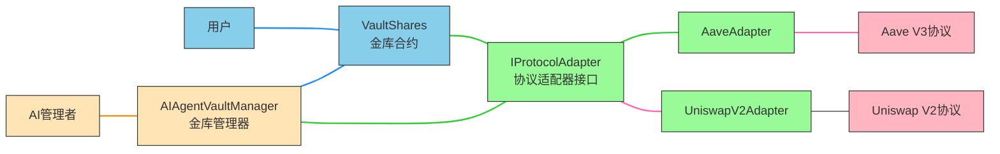

# AI Vault 项目文档

AI Vault 是一个基于 Scaffold-ETH 2 构建的去中心化金融（DeFi）项目，旨在为用户提供智能资产管理服务。该项目通过 AI 代理管理投资策略，将资金分配到不同的 DeFi 协议中以获取收益。

## 项目概述

AI Vault 项目包含一个核心金库合约和多个协议适配器，允许用户存入资产并由 AI 代理自动管理投资组合。金库基于 ERC-4626 标准实现，支持份额化投资和收益分配。

## 核心组件

### 1. AIAgentVaultManager.sol
AI 代理金库管理器，负责：
- 管理金库资产分配策略
- 批准和管理协议适配器
- 提供 AI 代理执行操作的接口
- 控制金库的紧急停止等功能
- 配置协议适配器的具体参数

### 2. VaultShares.sol
核心金库合约，功能包括：
- 基于 ERC-4626 标准实现
- 支持存款、取款和份额管理
- 管理资金在不同 DeFi 协议间的分配
- 收取管理费用

### 3. 协议适配器
为不同 DeFi 协议提供统一接口：

#### UniswapV2Adapter.sol
- 支持在 Uniswap V2 上提供流动性
- 自动计算最优交易路径
- 管理滑点容忍度设置
- 配置代币对和配对代币

#### AaveAdapter.sol
- 支持在 Aave V3 上存借资产
- 获取存款利息收益

## 系统架构图



## 工作流程

1. **金库创建**：用户创建 VaultShares 金库并存入资产
2. **适配器配置**：AI 管理者通过 AIAgentVaultManager 配置协议适配器参数
3. **策略制定**：AI 管理者通过 AIAgentVaultManager 制定投资策略
4. **策略执行**：AIAgentVaultManager 调用 VaultShares 执行投资策略
5. **资金分配**：VaultShares 通过协议适配器将资金分配到不同 DeFi 协议
6. **收益获取**：各协议产生收益并返回给 VaultShares
7. **收益分配**：VaultShares 将收益分配给份额持有者

## 主要功能

### 金库功能（VaultShares.sol）
1. **存款和取款**：用户可以存入资产并获得份额凭证
2. **投资管理**：根据策略在不同协议间分配资金
3. **收益获取**：通过 DeFi 协议获取收益并分配给用户
4. **费用管理**：收取管理费用并分配给协议所有者
5. **紧急停止**：在紧急情况下停止金库操作

### 协议适配器功能
1. **统一接口**：为不同 DeFi 协议提供标准化接口
2. **投资操作**：支持投资（invest）和撤资（divest）操作
3. **价值评估**：实时计算在协议中的资产价值
4. **参数配置**：支持配置特定协议参数（如滑点容忍度、配对代币等）

### AI 管理功能（AIAgentVaultManager.sol）
1. **策略更新**：允许 AI 代理更新资产分配策略
2. **适配器管理**：
   - 批准和管理可用的协议适配器
   - 配置协议适配器的具体参数（如滑点容忍度、代币对等）
3. **全局控制**：控制所有金库的紧急停止等操作
4. **直接调用**：可以直接调用适配器的任意函数
5. **批量操作**：支持批量更新多个金库的分配策略

## 技术特点

### 安全性
- 使用 OpenZeppelin 合约库确保标准实现
- 防重入攻击保护
- 所有权控制和访问限制
- 参数验证和边界检查

### 可扩展性
- 模块化设计，支持添加新的协议适配器
- 标准化接口便于集成新协议
- 灵活的配置管理

### 易用性
- 符合 ERC-4626 标准，易于集成
- 清晰的事件日志便于跟踪操作
- 详细的错误处理和提示

## 部署和使用

### 环境要求
- Node.js (>= v20.18.3)
- Yarn
- Foundry

### 部署步骤
1. 安装依赖：
   ```bash
   yarn install
   ```

2. 启动本地网络：
   ```bash
   yarn chain
   ```

3. 部署合约：
   ```bash
   yarn deploy
   ```

### 测试
运行测试：
```bash
yarn test
```

## 未来发展方向

1. **更多协议支持**：添加对 Curve、Compound 等协议的支持
2. **高级策略**：实现更复杂的 AI 投资策略
3. **风险管理**：集成风险评估和控制机制
4. **治理功能**：添加 DAO 治理功能，让用户参与决策

## 贡献

欢迎对项目进行贡献，可以通过提交 issue 或 pull request 的方式参与开发。

## 许可证

本项目基于 MIT 许可证开源。